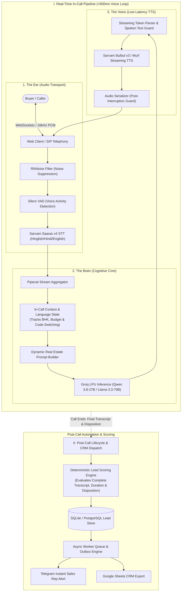

# Multilingual AI Voice Agent for Enterprise Real Estate

[](https://www.python.org/downloads/)
[](https://fastapi.tiangolo.com)
[](https://github.com/pipecat-ai/pipecat)
[](https://groq.com)
[](https://sarvam.ai)

A production-grade, ultra-low-latency (<600ms voice-to-voice) conversational AI voice agent engineered for enterprise real estate sales qualification. Built with an event-driven streaming pipeline supporting Indian code-switching (English, Hindi, and Hinglish), intelligent barge-in interruption handling, deterministic lead scoring, automated site visit booking, and instant CRM/Telegram dispatch.

---

## Architecture & Data Flow



---

## Core Capabilities

- **Sub-600ms Latency Budget:** 
  - **STT:** ~140ms with Sarvam Saaras v4 streaming WebSocket.
  - **LLM TTFT:** ~280ms–350ms powered by Groq LPUs with pre-warmed context caches.
  - **TTS TTFA:** ~150ms–200ms via chunked Sarvam Bulbul v3 synthesis.
  - **Blended Cost:** ~₹1.80/min ($0.019/min) across STT, LLM, and TTS.
- **Natural Barge-In & Interruption Handling:** Active audio stream cancellation with a 1.0s post-interruption guard window to prevent packet clipping or echo.
- **Fail-Safe Watchdog:** Detects silence and WebSocket stalls, firing automatic soft conversational nudges.
- **Multilingual Code-Switching:** Fluent handling of Indian English, Hindi, and everyday Hinglish (*"3 BHK mein payment plan offer hai kya?"*).
- **Lead Qualification & Site Visit Booking:** Real-time extraction of budget, configuration (2/3/4 BHK), and timeline, coupled with automated calendar appointment locking.
- **Automated Lead Scoring & CRM Dispatch:** Multi-factor scoring (Hot/Warm/Cold, 0–100 scale) and instant Telegram alerts dispatched to sales reps with call audio, full transcript, and customer qualification profile.

---

## Tech Stack

| Layer | Technology | Role |
|---|---|---|
| **Pipeline Framework** | Pipecat AI (v1.8.1) | Frame-based audio pipeline orchestration |
| **Inference Engine** | Groq LPU / Cerebras | Sub-350ms TTFT running Qwen 3.8-27B and Llama 3.3-70B |
| **Speech-to-Text** | Sarvam Saaras v4 / Deepgram | Low-latency Hinglish & Indian English ASR |
| **Text-to-Speech** | Sarvam Bulbul v3 / Murf | Low-latency neural voice synthesis |
| **Backend & Transport** | FastAPI + WebSockets | High-concurrency async streaming gateway |
| **Data & CRM Outbox** | Redis + SQLite / PostgreSQL | Call state persistence & reliable webhook dispatch |
| **Audio Processing** | Web Audio API + RNNoise + Silero VAD | Real-time 16kHz PCM capture and noise suppression |

---

## Quickstart

### 1. Installation
```bash
git clone https://github.com/Deepshikha-Chhaperia/voicebot.git
cd voicebot/voice-bot

python -m venv .venv
# Windows: .venv\Scripts\activate | Linux/macOS: source .venv/bin/activate
pip install -r requirements.txt
```

### 2. Configuration
Create a `.env` file in `voice-bot/`:
```env
ENV=dev
SARVAM_API_KEY=your_sarvam_api_key
GROQ_API_KEY=your_groq_api_key
TELEGRAM_BOT_TOKEN=your_telegram_bot_token
TELEGRAM_CHAT_ID=your_telegram_chat_id
MAX_CONCURRENT_CALLS=50
```

### 3. Run Server
```bash
uvicorn main:app --host 0.0.0.0 --port 8000 --reload
```
Open `http://localhost:8000` to start testing via the web client interface.

---

## Author

**Deepshikha Chhaperia**  
GitHub: [@Deepshikha-Chhaperia](https://github.com/Deepshikha-Chhaperia)
